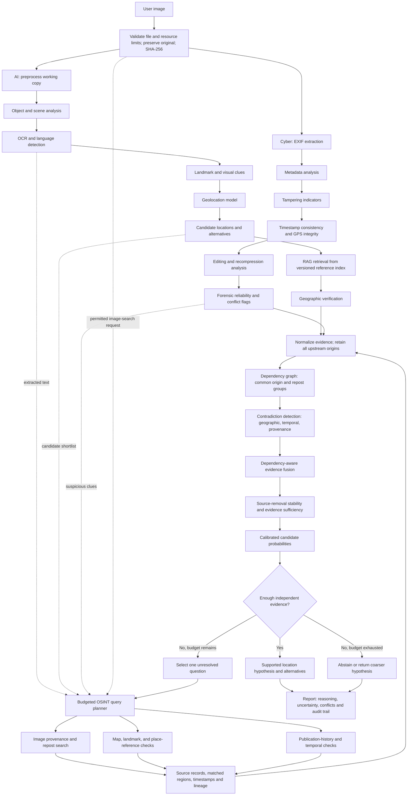

# GeoTrace AI — AI, cyber, and targeted OSINT architecture

Design revision: September 19, 2026. Based on the original pipeline supplied by the user. Browser-side EXIF/GPS, English OCR, manual OSINT handoffs, source grouping, and abstention outcomes are implemented. Automated provider collection, landmark recognition, typed conflicts, and calibrated location confidence remain planned.

## Integrated flow

Validation and original-file hashing move to a shared intake gate before either branch decodes the image. AI preprocessing operates on a working copy, with derivative hashes and transform records; cyber analysis retains access to the original bytes. The existing cyber validation/hash functions can serve this gate.

AI and cyber continue in parallel. OSINT jobs may start as soon as their required clues exist; the planner does not wait for every branch to finish. Cyber flags can cancel or deprioritize searches driven by suspect metadata. External image transmission requires the case's configured permission; text/reference checks can still run without transmitting the image.

## Where OSINT adds value

| Entry point | Targeted operation | Evidence returned |
|---|---|---|
| Original image or approved derivative | Reverse-image/near-duplicate search through an authorized provider | Matching public pages, crop/transformation matches, observed publication history, source lineage |
| OCR and language output | Search distinctive text with alternative candidate regions | Matched place names, reference text, source URL and ambiguity |
| Candidate location shortlist | Compare map geometry, landmarks, terrain, and available reference imagery | Candidate-specific supporting and contradicting observations, matched regions, reference dates |
| Timestamp or context disagreement | Check dated source records and suitable historical references | Observed time bounds and contradictions; never infer capture time from crawl time alone |
| Unstable fusion result | Seek evidence addressing the actual disagreement | A focused check that distinguishes candidates instead of another broad search |

OSINT does not automatically identify people, retrieve private accounts, or perform live-person tracking. Its scope here is verification of imagery, public provenance, and geographic hypotheses.

## RAG and OSINT roles

RAG supplies indexed reference material to geographic reasoning. OSINT gathers and verifies external observations. New OSINT records may later enter the RAG index, but retain stable source and origin IDs. A fact obtained through OSINT and quoted again by RAG is one underlying source, not two confirmations. AI agreement with its own retrieved context is also not independent evidence.

## Efficiency policy — proposed starting configuration

These are tunable engineering defaults, not measured optimal values:

- Start with the top three candidate regions and retain the remainder. Keep an explicit candidate-recall check; if no candidate is supported, expand once or abstain instead of forcing the initial shortlist.
- Run at most three external jobs concurrently, with provider-specific limits. Share in-flight identical queries.
- Set a per-case cap of 12 external requests, two targeted verification rounds, and 30 seconds of external lookup time. Account for retries inside these budgets. Cancel outstanding work at the deadline and report partial evidence.
- Use case/access-scoped caches keyed by asset or query fingerprint, provider, geographic/time filters, and reference version. Set freshness per source; an old result must not masquerade as a current lookup. Never cache user evidence in a public cache.
- Fetch candidate metadata first, then inspect only selected matches. Deduplicate results before expensive matching or model inference.
- Prioritize a query by the unresolved contradiction it can test and estimated cost. Do not claim expected information gain without a model that estimates it.
- Stop early only when sufficiency, contradiction, and stability gates pass. Otherwise stop at the budget and abstain. More requests are not evidence of higher confidence.
- Track lookup count, median/p95 latency, cache hit rate, independent-source yield, location error, and selective error/coverage. Compare with an exhaustive-search baseline to quantify whether efficiency sacrifices recall.

The adaptive retrieval policy changes which evidence reaches fusion. Fit and evaluate calibration on outputs produced by the same policy, including its early-stop decisions and budget limits. Version the policy and recalibrate/revalidate after changes; a calibrator fitted on full evidence need not remain valid after selective retrieval.

## Evidence record and dependency handling

Retain `evidence_id`, `source_id`, canonical source URL, retrieval time, stated publication time (with provenance), source content hash, image/region references, extraction method and version, candidate support, reliability components, and the originating query/candidate. Separate observed facts from model inferences.

Map to the current prototype's `id`, `source_id`, `origin_ids`, `derived_from`, optional `asset_sha256`, `support`, and `reliability` fields. Record direct image-derived clues under the same original-image lineage. A RAG excerpt inherits its document lineage. Reposts inherit the earliest evidenced common ancestor, which need not be the true original publication. A search-provider result is a pointer to a source, not itself a new corroborating source.

The current union-find implementation conservatively merges any declared dependencies. A reference match depends both on the input image and the reference record; encoding both may overmerge groups. Production integration therefore needs typed edges distinguishing source content, processing lineage, and independent reference corroboration, plus a validated partial-dependence policy. Do not inflate independence by omitting real dependencies just to satisfy a two-group threshold.

Near-duplicate matching should provide a similarity score and a verified transform/crop relationship before asserting common origin. Identical coordinates, agreement, or the same domain alone do not establish shared origin. Conversely, different domains do not establish independence.

## Contradictions and final output

Maintain an explicit conflict ledger:

- Geographic: metadata, scene clues, and reference matches favor incompatible regions.
- Temporal: a claimed capture date conflicts with a documented earlier appearance or known scene timeline, accounting for uncertain dates.
- Provenance: apparently independent corroboration resolves to one common source.
- Forensic context: a clue lies within a suspect image region or depends on questionable metadata. Editing/recompression indicators alone are not proof of falsification.

Only geographic pairwise disagreement and basic dependency grouping are implemented in the current prototype. Temporal checks, region-specific forensic weighting, and typed lineage are planned.

Replace unconditional `FINAL LOCATION + CONFIDENCE SCORE` with:

1. Supported location hypothesis, coarser region, or insufficient evidence.
2. Ranked alternatives and conditional candidate probabilities.
3. Separate forensic reliability and evidence coverage; neither is a location probability.
4. Conflicting observations, grouped source lineage, and source-removal sensitivity.
5. Retrieval budget used, missing checks, model/reference/calibration versions, and analyst-review status.

Coarser regions and open-set unknown-location probabilities are planned, not produced by the current two-or-more-candidate prototype. No conflict should silently disappear merely because fusion chooses a winner.

## Build order

1. Implement normalized adapters for existing cyber results and the AI candidate generator.
2. Add the budgeted planner and a mock OSINT provider; verify timeout, caching, cancellation, dependency inheritance, and partial-result behavior.
3. Integrate one authorized real reference source, then one provenance-search source. Preserve provenance from the first ingestion.
4. Extend dependency representation and conflict types using labeled cases.
5. Fit and test calibration on disjoint media/source/event families under the full retrieval policy.
6. Connect reports to the saved website's investigation UI after approval for that website work.

The next implementation slice is the planner with a mock provider, not broad live web collection. No patent novelty claim follows from this architecture.
